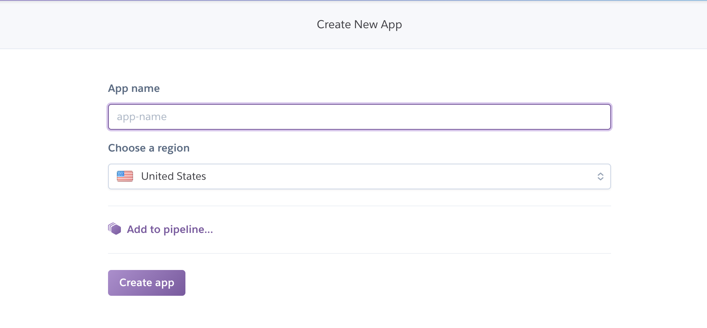
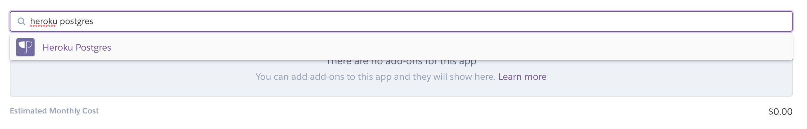
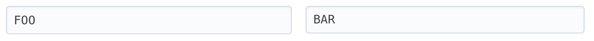

# Heroku Deployment

Before we begin you will need to sign up for a free Heroku account. [You can do so here](https://signup.heroku.com/)

Once you have your account you will need to start by creating a new app. On [https://dashboard.heroku.com/apps](https://dashboard.heroku.com/apps) hit the "new" dropdown and select create new app.



You will need to give the app an available name. For this demo I called the app spring-deployment-demo.

Once your app is created go to the resources tab. Under add-ons search for `heroku postgres` using the provided form.  



Next we'll want to take our Spring application and run it. If you don't have a Spring Application ready to deploy, this one is properly set up for you to try. 

First you will need to install the [Heroku CLI](https://devcenter.heroku.com/articles/heroku-cli#download-and-install) which you can do on mac with a simple brew command. 

```bash
$ brew update
$ brew install heroku/brew/heroku 
```

That will generally take about a minute. Once done you will need to login with the CLI using the credentials you used to sign up. 

```
$ heroku login
```

This will prompt you for a username and password.

Next, within the project you will want to initialize it as a git repo if it isn't already. From there you'll add the Heroku repo as a remote. 

```bash
$ heroku git:remote -a spring-deployment-demo
```

Your command will be different just based on what you called your app in Heroku. If you are unsure the deploy tab on the Heroku dashboard will have the exact command. 

Now that you have the repo set up, you just need to make sure that you have the proper depencies set up. In this demo app we are using the postgres database, so we need the postgres package from Maven.

```XML
<dependency>
    <groupId>org.postgresql</groupId>
    <artifactId>postgresql</artifactId>
</dependency>
```

Including this will allow Spring to connect to your postgres database. Spring will also autoconfigure the connection string to the `DATABASE_URL` environment variable. Heroku provides this automatically so you won't have to add any variables to your application properties. If you want to see this variable in Heroku you may do so by going to the settings tab and click on the button labelled "Reveal Config Vars"

If you want to modify your configuration you may also add variables here and use them within your Spring `application.properties` file using the syntax

```
${CONFIG_VAR_NAME}
```

Example



```
spring.foo=${FOO}
```

This will set the configuration variable spring.foo to the value "BAR"

once you have all of your configuration set up, you will just want to commit all your changes and then push them to Heroku. 

```
$ git push heroku master
```

Your application should build and assuming there are no compilation errors will start to run. The link to your app will be at the bottom of the settings page of your app.

In some cases, you're app may fail to start. One possible situation is your database isn't being created properly. When encountering this issue you can fix it by setting `SPRING_JPA_HIBERNATE_DDL-AUTO` to `create` in your config vars in Heroku. 

Once the app goes up, you will have to change this value to `update` or delete it altogether.